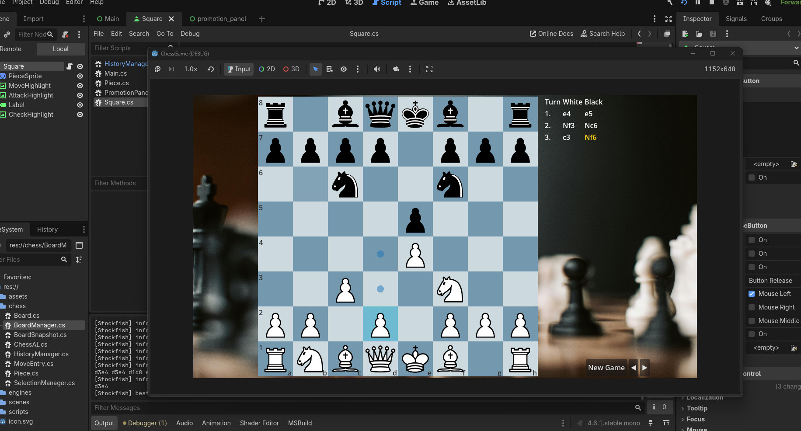

# From Game Logic to the Screen – Signals, Scenes, and Input

*Part 2 of the Godot game development series. In this post we look at how to keep game rules separate from the engine, how to build the board from a reusable scene, and how signals and input connect the two.*

In the previous post we focused on **project structure**: scenes, nodes, and how scripts interact with the scene tree.

Now we’ll look at how the **game logic connects to the UI**. The chess rules live in plain C# classes, while the Godot scenes handle input and rendering. Signals and scene instancing provide the glue between the two layers.

The full project used in this tutorial is available in the [project repository](/games/chess-game/), so you can follow along or explore the complete implementation.

---

## 1. Why Separate Logic from Presentation

Game rules—what is a legal move, who wins, what state changes—should be **testable and independent of the game engine**.

If you ever port the game, change the UI, or rewrite the frontend, you want the core logic to stay intact. The rules of chess shouldn’t depend on sprites, buttons, or scene nodes.

In this project the separation is explicit:

* **`chess/`** – Plain C# classes: `Board`, `Piece`, `BoardManager`, `SelectionManager`, `BoardSnapshot`, `MoveEntry`, `ChessAI`.
  These classes contain the **game rules**. They avoid referencing Godot types and work with simple data structures like arrays, enums, and method calls.

* **`scripts/` and scenes** – `Main`, `Square`, `PromotionPanel`, `HistoryManager` (as a Node).
  These interact with the Godot engine: they reference UI nodes, load resources, and update the screen.

So the relationship becomes:

```
UI (Godot scenes & scripts)
        ↓
Game Logic (plain C# classes)
```

The UI **asks the logic layer questions** like:

* “What piece is on this square?”
* “What moves are legal?”
* “What happens if this piece moves here?”

The logic answers those questions and returns the result. The UI then updates the visuals accordingly.

The `Main` script acts as the **coordinator**. It owns both the `Board` object and the UI nodes, and it connects player input (clicking squares) to game logic (executing moves).

---

## 2. Data Model in Plain C#

The chess game state is represented by a simple **8×8 grid of pieces** and a few additional fields (for example the *en passant* target square).

There are no nodes, textures, or engine objects involved—just plain C# data.

### Board

The `Board` class stores the pieces and controls the flow of the game.

```csharp
public class Board
{
    public Piece[,] board = new Piece[8, 8];

    public void SetupBoard() { /* place pieces in starting position */ }

    public Piece GetPiece(int x, int y)
        => /* bounds check and return */;

    public (MoveResult Result, MoveEntry Entry) MovePiece(
        int fromX, int fromY, int toX, int toY)
    {
        /* ... */
    }
}
```

The board tracks where pieces are located and applies moves. When a move happens, it returns both the **result** (normal move, capture, promotion, etc.) and a **move entry** describing what changed.

---

### Piece

The `Piece` class stores the piece type and color, and knows how to generate moves for that piece.

```csharp
public class Piece
{
    public PieceType Type { get; set; }
    public PieceColor Color { get; set; }

    public List<(int x, int y)> GetLegalMoves(int fromX, int fromY, Board board)
    {
        var pseudoMoves = GetPseudoMoves(fromX, fromY, board);
        var legalMoves = new List<(int, int)>();

        foreach (var move in pseudoMoves)
        {
            if (!board.MoveLeavesKingInCheck(fromX, fromY, move.x, move.y, Color))
                legalMoves.Add(move);
        }

        return legalMoves;
    }
}
```

There are two steps here:

1. **Pseudo-legal moves** – All moves the piece could theoretically make based on movement rules.
2. **Legal moves** – Pseudo moves filtered to remove those that would leave the king in check.

That filtering happens entirely in the **logic layer**.

The UI never decides what moves are legal. Instead it simply asks the board:

> “What moves can this piece make?”

and then displays the result.

This keeps the rules of the game **centralized, testable, and independent of the engine**.

---

## 3. Creating the Board UI from a Scene

We don’t create 64 squares manually in the editor. Instead, we define **one reusable Square scene** and instantiate it 64 times at runtime.

This is a common Godot pattern: **one scene definition, many instances.**

### PackedScene

First we load the square scene as a `PackedScene`:

```csharp
squareScene = GD.Load<PackedScene>("res://scenes/Square.tscn");
```

A `PackedScene` is essentially a **template for a node tree**. Once loaded, we can create new copies of that scene whenever we need one.

---

### BoardManager

The `BoardManager` is responsible for filling the `GridContainer` with square instances.

```csharp
public void Init(GridContainer boardUI, PackedScene squareScene)
{
    this.boardUI = boardUI;

    for (int y = 0; y < 8; y++)
    {
        for (int x = 0; x < 8; x++)
        {
            Square sq = squareScene.Instantiate<Square>();
            sq.X = x;
            sq.Y = y;

            boardUI.AddChild(sq);
            squares[x, y] = sq;
        }
    }
}
```

For each `(x, y)` coordinate on the board:

1. A new square is instantiated from the scene
2. The square stores its board coordinates
3. It is added to the `GridContainer`
4. We store a reference to it in the `squares` array

The container automatically arranges the nodes into an **8×8 grid**.

Each square now knows its position on the board. So when a player clicks a square, the game can immediately determine **which cell was selected**.

---

### UI Reflects Game State

The UI does **not** track the real game state.

The single source of truth is the `Board` object:

```
Board.board[8,8]
```

The UI simply reflects that state.

For example, when the board needs to update the visuals:

```csharp
RefreshBoard()
```

might loop through all squares and update their piece display:

```csharp
square.SetPiece(board.GetPiece(square.X, square.Y));
```

This keeps responsibilities clean:

* **Board** → stores game state
* **UI** → displays that state



---

## 4. Signals: UI Not Calling Game Logic Directly

Squares should not directly call game logic. They don’t know about the `Board`, move validation, or turn order.

Instead, they only know one thing:

> “I was clicked.”

To communicate that event upward, they emit a **signal**.

Signals are Godot’s built-in event system. A node can emit a signal, and other nodes can **subscribe** to it.

---

### Declaring the Signal

Inside the `Square` script we declare a signal:

```csharp
[Signal]
public delegate void SquareClickedEventHandler(Square square, string button);
```

This signal sends two pieces of information:

* the square that was clicked
* which mouse button triggered the event

---

### Emitting the Signal

When the button is pressed, the square emits the signal:

```csharp
public override void _Pressed()
{
    EmitSignal(SignalName.SquareClicked, this, "left");
}
```

For right-click we use `_GuiInput` (covered in the next section) and emit the signal with `"right"`.

The important idea is that **the square itself does not decide what the click means**. It simply reports that the event happened.

---

### Subscribing to the Signal

The `Main` script subscribes to this signal during initialization:

```csharp
foreach (Square sq in boardGrid.GetChildren())
{
    sq.SquareClicked += (s, button) => OnSquareClicked((Square)s, (string)button);
}
```

When a square emits `SquareClicked`, the `Main` node receives it and decides what to do—selecting pieces, attempting moves, or showing highlights.

So the flow becomes:

```
Square clicked
      ↓
Square emits signal
      ↓
Main receives signal
      ↓
Main applies game logic
```

This pattern appears throughout the project. For example:

* `PromotionPanel.PromotionSelected`
* `HistoryManager.RequestBoardState`

UI elements **emit signals**, and a coordinating script (usually `Main`) translates those events into actions like moves, history navigation, or UI updates.

---

## 5. Input Handling

Our chess board needs to react to two types of clicks:

* **Left-click** → select a piece or make a move
* **Right-click** → cancel the current selection

The `Button` node already provides `_Pressed()` for its primary action (typically a left-click). However, if we want to distinguish between **left and right mouse buttons**, we need to inspect the input event ourselves.

For that, we override `_GuiInput`.

```csharp
public override void _GuiInput(InputEvent @event)
{
    if (@event is InputEventMouseButton mouseButton && mouseButton.Pressed)
    {
        if (mouseButton.ButtonIndex == MouseButton.Left)
            EmitSignal(SignalName.SquareClicked, this, "left");
        else if (mouseButton.ButtonIndex == MouseButton.Right)
            EmitSignal(SignalName.SquareClicked, this, "right");
    }
}
```

Here’s what happens step by step:

1. Godot sends an `InputEvent` to the node.
2. We check whether it is a **mouse button event**.
3. If the button was pressed, we determine whether it was **left** or **right**.
4. The square emits a `SquareClicked` signal with that information.

So the square converts **raw input events** into something more meaningful for the rest of the game:

```
Mouse event
      ↓
Square interprets it
      ↓
Signal: (square, button)
```

The important design principle here is that **input handling stays in the view layer**.

The game logic never deals with:

* `InputEvent`
* mouse button indices
* Godot input APIs

Instead, the logic only sees:

> “Square (x, y) was clicked with left/right button.”

This keeps the core chess logic independent from the engine.

---

## 6. Threading and the Main Thread

The chess AI in this project runs **Stockfish** as a separate process. We read its output asynchronously from a **background thread**.

When Stockfish sends a line such as:

```
bestmove e2e4
```

our callback is triggered on that background thread.

However, **Godot’s APIs are not thread-safe**. This means you cannot safely access:

* nodes
* the scene tree
* `GetNode`
* UI elements
* most Godot objects

from any thread except the **main thread**.

So if a background thread receives data from Stockfish, we must schedule the game update to run on the main thread.

---

### Background Thread Reading Engine Output

The `ChessAI` class reads the engine output in a loop:

```csharp
void ReadOutput()
{
    while (!engine.StandardOutput.EndOfStream)
    {
        string line = engine.StandardOutput.ReadLine();

        if (line != null && line.StartsWith("bestmove "))
            OnBestMoveReceived?.Invoke(line);
    }
}
```

This callback runs on the **reader thread**, not the Godot main thread.

---

### Switching Back to the Main Thread

In `Main`, we subscribe to the callback and use `CallDeferred`:

```csharp
ai.OnBestMoveReceived = (line) => CallDeferred(nameof(OnStockfishResponse), line);
```

`CallDeferred` schedules the method to run **later on the main thread**, where it is safe to interact with Godot objects.

Once `OnStockfishResponse` runs, we can safely update the board, move pieces, and refresh the UI.

---

### Rule of Thumb

Whenever a callback or event originates from **another thread**, do not directly touch the scene tree.

Instead:

> Use `CallDeferred()` to move execution back to the **main thread** before interacting with Godot nodes.

This pattern is essential when working with background threads, networking, or external processes.

---

## 7. Concepts Covered

In this post we connected the **game logic layer** with the **UI layer** and looked at the patterns that keep them cleanly separated.

| Concept                       | Role                                                                                                                                                         |
| ----------------------------- | ------------------------------------------------------------------------------------------------------------------------------------------------------------ |
| **Logic vs View**             | Game rules live in plain C# classes; UI nodes only display state and forward player input.                                                                   |
| **PackedScene / Instantiate** | Define a scene once and create many instances at runtime (used to build the 64 board squares).                                                               |
| **Signals**                   | Declared with `[Signal]` and a delegate; emitted with `EmitSignal`; subscribed to with `+=`. Children emit events, and a parent or coordinator handles them. |
| **_GuiInput**                 | Custom input handling on a `Control`. We use it to distinguish left vs. right mouse clicks and emit a single signal.                                         |
| **CallDeferred**              | Schedules a method to run on the main thread. Useful when callbacks originate from background threads (such as reading Stockfish output).                    |

Taken together, these patterns give us a clear architectural split:

```
Game Logic
(Board, Piece, move rules)
        ↑
Coordinator
(Main)
        ↑
View
(Square, PromotionPanel, UI nodes)
```

The **logic layer defines what the game is**, while the **view layer handles how the game is displayed and controlled**.

This separation keeps the project easier to reason about and makes the core rules reusable outside the engine.

If you'd like to explore the full implementation — including the board logic, square scene, and project setup — the complete source code for this tutorial is available in the [project repository](/games/chess-game/).

---

### Next Steps

In the next posts we’ll build on this foundation and look at how these patterns apply to broader game design:

* structuring **turn-based gameplay**
* coordinating **game state and UI updates**
* extending the same architecture to more dynamic games

Once these patterns become familiar, they scale surprisingly well—from a small chess board to much larger game systems. ♟️
