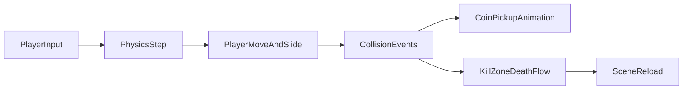

# From Input to Playable Loop – Beginner 2D Platformer in Godot C#

*Part 3 of the Godot game development series. In this post, we build and explain a complete 2D platformer loop: movement, jumping, collecting coins, dying, and restarting.*

In the chess posts, we focused on clean structure and signal-driven flow.  
In this project, we apply those same ideas to a real-time game.

The full project used in this tutorial is available in the [project repository](/games/2d-platform/), so you can follow along with the same scenes and scripts.

---

## 1. What We Are Building

A beginner platformer usually feels confusing at first because many small systems run together:

* input
* physics
* animation
* collisions
* restart flow

So instead of learning each system in isolation, we will trace one full gameplay loop:

1. Press left/right and jump
2. Move through the level
3. Collect a coin
4. Touch a kill zone and die
5. Restart the same scene

That gives you a practical mental model you can reuse for future games.

---

## 2. Scene Composition: One Level, Many Reusable Scenes

The main scene (`game.tscn`) is built by instancing smaller scenes:

* `player.tscn`
* `coin.tscn` (many copies)
* `slime.tscn` (many copies)
* `kill_zone.tscn`
* `platform.tscn`

Conceptually:

```text
Game (Node2D)
├── TileMapLayer
├── Player
│   └── Camera2D
├── Platforms
├── Slimes
├── Coins
├── KillZone
└── Music
```

This is a strong beginner pattern:

> Build one thing once, then place instances in the level.

It keeps your project organized and helps you avoid giant scene files.

---

## 3. Player Physics Loop in `_PhysicsProcess`

The heart of the platformer is in `Player.cs`.

```csharp
public override void _PhysicsProcess(double delta)
{
    Vector2 velocity = Velocity;

    if (!IsOnFloor())
        velocity += GetGravity() * (float)delta;

    if (Input.IsActionJustPressed("ui_accept") && IsOnFloor())
        velocity.Y = JumpVelocity;

    Vector2 direction = Input.GetVector("ui_left", "ui_right", "ui_up", "ui_down");

    if (direction != Vector2.Zero)
        velocity.X = direction.X * Speed;
    else
        velocity.X = Mathf.MoveToward(Velocity.X, 0, Speed);

    Velocity = velocity;
    MoveAndSlide();
}
```

What matters most for beginners:

* **Gravity every physics tick** when not on floor
* **Jump only when grounded** (`IsOnFloor()`)
* **Horizontal speed** from input
* **Deceleration** when input is released
* **`MoveAndSlide()`** applies the velocity and handles collisions

Why `_PhysicsProcess` and not `_Process`?

Because movement and collisions should update on the physics step, which is more stable and predictable for gameplay.

---

## 4. Animation State: Idle, Run, Jump

The same script updates visual state using `AnimatedSprite2D`:

* flip sprite left/right based on direction
* choose animation from floor + movement state

```csharp
if (direction.X > 0)
    GetNode<AnimatedSprite2D>("AnimatedSprite2D").FlipH = false;
else if (direction.X < 0)
    GetNode<AnimatedSprite2D>("AnimatedSprite2D").FlipH = true;

if (IsOnFloor())
{
    if (direction.X == 0)
        GetNode<AnimatedSprite2D>("AnimatedSprite2D").Play("idle");
    else
        GetNode<AnimatedSprite2D>("AnimatedSprite2D").Play("run");
}
else
{
    GetNode<AnimatedSprite2D>("AnimatedSprite2D").Play("jump");
}
```

Even this simple 3-state setup makes the game feel responsive.

---

## 5. Signals as Gameplay Glue: Collect and Die

Two different `Area2D` systems demonstrate event-driven gameplay:

* `Coin` reacts to `body_entered` and plays pickup animation
* `KillZone` reacts to `body_entered`, applies death flow, then restarts

### Coin collection

```csharp
private void _on_body_entered(Node2D body)
{
    GD.Print("Coin collected by: " + body.Name);
    _AnimationPlayer.Play("pickup");
}
```

In this setup, animation handles the visual and eventually removes the coin (via the scene animation track).

### Death and restart

```csharp
private void _on_body_entered(Node2D body)
{
    Engine.TimeScale = 0.5f;
    _timer.Start();
}

private void _on_timer_timeout()
{
    Engine.TimeScale = 1.0f;
    GetTree().ReloadCurrentScene();
}
```

This gives you a lightweight “fail and retry” loop that beginners can understand immediately.

---

## 6. Why This Structure Reduces Bugs

There is an important design idea here:

* movement logic runs in one place (`Player._PhysicsProcess`)
* interactions are event-driven (`body_entered`, `timeout`)
* scene composition is explicit (`game.tscn` instances reusable scenes)

So your update flow is not random polling across many scripts.  
It is clear, predictable, and easier to debug.



---

## 7. Mini Experiment: Tune Movement Feel in 5 Minutes

Goal: understand how two constants change game feel.

In `Player.cs`:

```csharp
public const float Speed = 130.0f;
public const float JumpVelocity = -300.0f;
```

Try these values and run the same jump sequence each time:

| Test | Speed | JumpVelocity | What to observe |
| --- | --- | --- | --- |
| A (default) | 130 | -300 | baseline |
| B | 170 | -300 | faster horizontal control |
| C | 130 | -360 | higher jump arc |
| D | 170 | -360 | faster and more arcade-like |

Measure:

* time to cross a familiar platform section
* whether jumps feel too short, too floaty, or just right

You just practiced game-feel balancing without adding any advanced systems.

---

## 8. Concepts Covered

| Concept | Role in this project |
| --- | --- |
| `CharacterBody2D` | Base node for player movement and collision |
| `_PhysicsProcess` | Stable update loop for movement logic |
| `Velocity` + `MoveAndSlide` | Core platformer movement pattern in Godot |
| `Area2D` signals | Event-driven collect/death interactions |
| `Engine.TimeScale` | Simple slow-motion feedback on death |
| `ReloadCurrentScene()` | Fast restart loop for beginner games |

---

### Next Post

In the next post, we go deeper into **systems thinking**:

* collision layers and masks (who can interact with what)
* reusable scene design for enemies, coins, and platforms
* beginner-safe polish choices (camera, audio, patrol AI)

That is where a simple prototype starts feeling like a real game.
