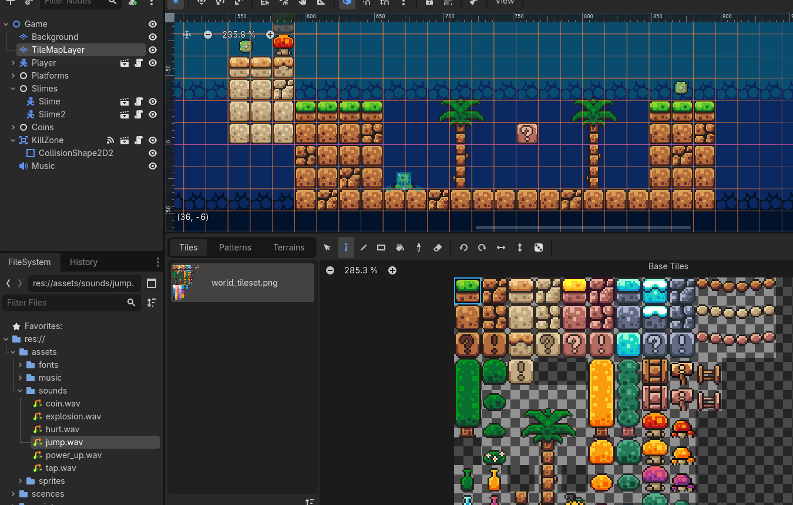
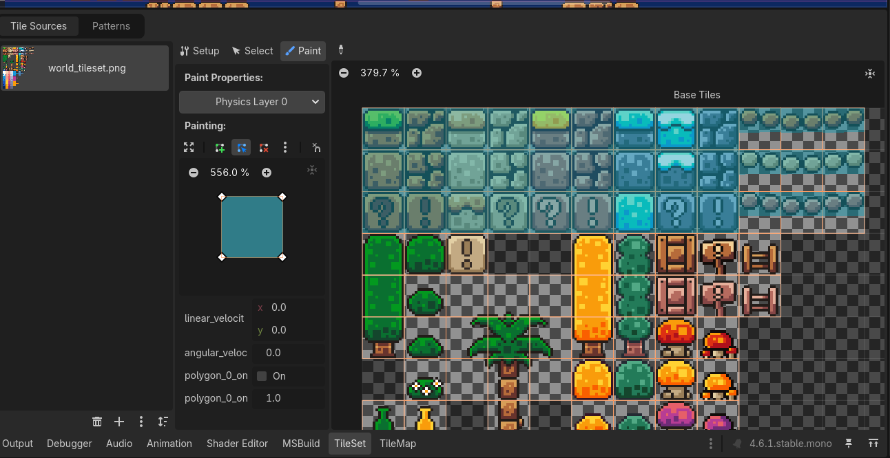

# From Input to Playable Loop – Beginner 2D Platformer in Godot C#

*Part 3 of the Godot game development series. In this post, we build and explain a complete 2D platformer loop: movement, jumping, collecting coins, dying, and restarting.*

In the previous chess posts, the game progressed one move at a time.  
Each action was triggered by a click, and the flow was easy to follow step by step.

A platformer feels very different.

Instead of waiting for input, the game is always running. The player moves, gravity pulls, and collisions happen continuously.

But even though the pace is different, the same ideas still apply:

* input triggers actions  
* the game updates its state  
* the screen reflects those changes  

The difference is not *what* we build, but **when it happens**.

In this project, we’ll use those same ideas to build a simple real-time game.

The full project used in this tutorial is available in the [project repository](/games/2d-platform/), so you can follow along with the same scenes and scripts.

---

## 1. What We Are Building (and How It Is Structured)

A beginner platformer can feel confusing at first because many small systems are happening at the same time:

* input  
* physics  
* animation  
* collisions  
* restarting the game  

Instead of learning each part separately, we will follow one simple gameplay loop from start to finish:

1. Press left/right and jump  
2. Move through the level  
3. Collect a coin  
4. Touch a kill zone and die  
5. Restart the same scene  

This gives you a clear mental model of how the game works as a whole.


---

To support this loop, we also need a simple and clean structure.

The main level scene (`game.tscn`) is built by combining smaller reusable scenes:

* `player.tscn`  
* `coin.tscn` (many copies)  
* `slime.tscn` (many copies)  
* `kill_zone.tscn`  
* `platform.tscn`  

Conceptually, the scene looks like this:

```text
Game (Node2D)
├── TileMapLayer
├── Player
│   └── Camera2D
├── Platforms
├── Slimes
├── Coins
├── KillZone
└── Music
```

Each part of the gameplay loop is handled by one of these pieces:

* the **player** handles movement and jumping
* **coins** react when the player touches them
* the **kill zone** handles death and restart
* the **level** provides the world and collisions

A useful beginner pattern is:

> Build one thing once, then place many copies of it in the level.

This keeps the project easy to understand and avoids large, messy scenes.

---

## 2. Building the Level with TileMapLayer

Before we talk about player movement, we need something to actually move on.

In Godot, levels are usually built using a `TileMapLayer`.  
This lets us paint a world using small reusable tiles instead of placing every platform manually.

---

### Where do the assets come from?

For beginner projects, you don’t need to draw everything yourself.

There are many free assets online, for example:

* Kenney (very beginner-friendly, clean style)
* OpenGameArt
* itch.io free asset packs

For this project, I used a simple tileset that already includes ground, platforms, and background tiles.

---

### Creating a TileMapLayer

Once you import the tileset into Godot:

1. Create a `TileMapLayer` node in your scene  
2. Assign a `TileSet` resource to it  
3. Open the tile painting panel  
4. Start drawing your level like a pixel grid  

Each tile becomes a small building block of your level.



---

### Solid vs Passable Tiles

One important step is telling the game what the player can stand on.

Inside the TileSet editor, you can mark tiles with collision shapes:

* **Solid tiles** → the player stands on them (ground, platforms)
* **Pass-through tiles** → background decorations, no collision

So visually, everything is just tiles —  
but logically, only some of them affect gameplay.



---

### Organizing layers (very important)

To keep things clean, we separate tiles into layers:

* **Main world layer** → platforms, ground, walls (has collision)
* **Background layer** → decorations, scenery (no collision)

This helps avoid confusion later when levels get bigger.

A simple rule:

> If the player interacts with it, it belongs in the main layer.  
> If it’s just visual, it belongs in the background.

---

### Why this matters

With TileMapLayer, we stop thinking in terms of individual objects like “a platform”.

Instead, we think in terms of:

> “building a world from tiles”

This is what makes level creation fast, consistent, and easy to change later.

---

## 3. Player Physics Loop in `_PhysicsProcess`

The heart of the platformer lives in `Player.cs`.

If you’ve never written movement code before, this part can feel intimidating.  
The good news is: **you don’t need to start from scratch**.

Godot already provides a common movement pattern for `CharacterBody2D`, and this script follows that pattern.  
Our goal here is not to invent something new, but to **understand it and build on top of it**.

```csharp
public override void _PhysicsProcess(double delta)
{
    Vector2 velocity = Velocity;

    if (!IsOnFloor())
        velocity += GetGravity() * (float)delta;

    if (Input.IsActionJustPressed("ui_accept") && IsOnFloor())
        velocity.Y = JumpVelocity;

    Vector2 direction = Input.GetVector("ui_left", "ui_right", "ui_up", "ui_down");

    if (direction != Vector2.Zero)
        velocity.X = direction.X * Speed;
    else
        velocity.X = Mathf.MoveToward(Velocity.X, 0, Speed);

    Velocity = velocity;
    MoveAndSlide();
}
```

---

### How to read this loop

Instead of reading the code line by line, it helps to think of it as a simple sequence that runs every physics frame:

```text
1. Apply gravity
2. Check for jump input
3. Read horizontal input
4. update velocity
5. Move the player and handle collisions
```

This same pattern appears in many platformer games.

---

### What matters most for beginners

* **Gravity every physics frame** when not on the floor
* **Jump only when grounded** (`IsOnFloor()`)
* **Horizontal speed** comes from player input
* **Slow down** when input is released
* **`MoveAndSlide()`** moves the player and resolves collisions

---

### Why `_PhysicsProcess` and not `_Process`?

Movement and collisions need to update at a stable rate.

`_PhysicsProcess` runs on the physics step, which keeps movement consistent and avoids strange behavior like missed collisions or uneven jumps.

So a good rule of thumb is:

> Use `_PhysicsProcess` for anything related to movement and physics.

---

## 4. Animation State: Idle, Run, Jump

The same script updates visual state using `AnimatedSprite2D`:

* flip sprite left/right based on direction
* choose animation from floor + movement state

```csharp
if (direction.X > 0)
    GetNode<AnimatedSprite2D>("AnimatedSprite2D").FlipH = false;
else if (direction.X < 0)
    GetNode<AnimatedSprite2D>("AnimatedSprite2D").FlipH = true;

if (IsOnFloor())
{
    if (direction.X == 0)
        GetNode<AnimatedSprite2D>("AnimatedSprite2D").Play("idle");
    else
        GetNode<AnimatedSprite2D>("AnimatedSprite2D").Play("run");
}
else
{
    GetNode<AnimatedSprite2D>("AnimatedSprite2D").Play("jump");
}
```

Even this simple 3-state setup makes the game feel responsive.

---

## 5. Signals as Gameplay Glue: Collect and Die

Two different `Area2D` systems demonstrate event-driven gameplay:

* `Coin` reacts to `body_entered` and plays pickup animation
* `KillZone` reacts to `body_entered`, applies death flow, then restarts

### Coin collection

```csharp
private void _on_body_entered(Node2D body)
{
    GD.Print("Coin collected by: " + body.Name);
    _AnimationPlayer.Play("pickup");
}
```

In this setup, animation handles the visual and eventually removes the coin (via the scene animation track).

### Death and restart

```csharp
private void _on_body_entered(Node2D body)
{
    Engine.TimeScale = 0.5f;
    _timer.Start();
}

private void _on_timer_timeout()
{
    Engine.TimeScale = 1.0f;
    GetTree().ReloadCurrentScene();
}
```

This gives you a lightweight “fail and retry” loop that beginners can understand immediately.

---

## 6. Mini Experiment: Tune Movement Feel in 5 Minutes

Goal: understand how two constants change game feel.

In `Player.cs`:

```csharp
public const float Speed = 130.0f;
public const float JumpVelocity = -300.0f;
```

Try these values and run the same jump sequence each time:

| Test | Speed | JumpVelocity | What to observe |
| --- | --- | --- | --- |
| A (default) | 130 | -300 | baseline |
| B | 170 | -300 | faster horizontal control |
| C | 130 | -360 | higher jump arc |
| D | 170 | -360 | faster and more arcade-like |

Measure:

* time to cross a familiar platform section
* whether jumps feel too short, too floaty, or just right

You just practiced game-feel balancing without adding any advanced systems.

---

## 7. Concepts Covered

Here’s a quick recap of the main ideas we used in this project:

| Concept | What it does in this game |
| --- | --- |
| `CharacterBody2D` | The base node that handles player movement and collisions |
| `_PhysicsProcess` | The stable update loop where movement logic runs |
| `Velocity` + `MoveAndSlide()` | The core movement pattern for platformers in Godot |
| `Area2D` signals | Used for interactions like collecting coins or triggering death zones |
| `Engine.TimeScale` | Simple slow-motion effect when the player dies |
| `ReloadCurrentScene()` | The easiest way to restart the level |

These are not “advanced systems” — they are just the building blocks that most 2D platformers use.

Once you understand how they fit together, you can reuse the same structure in almost any small game.

---

### Next Post

In the next post, we’ll start thinking more in terms of **game systems instead of individual scripts**.

We’ll cover:

* collision layers and masks (who can interact with what)
* how to design reusable scenes for things like enemies, coins, and platforms
* a few simple polish ideas (camera movement, sound, basic enemy behavior)

This is the point where a simple prototype starts to feel like a real game.
