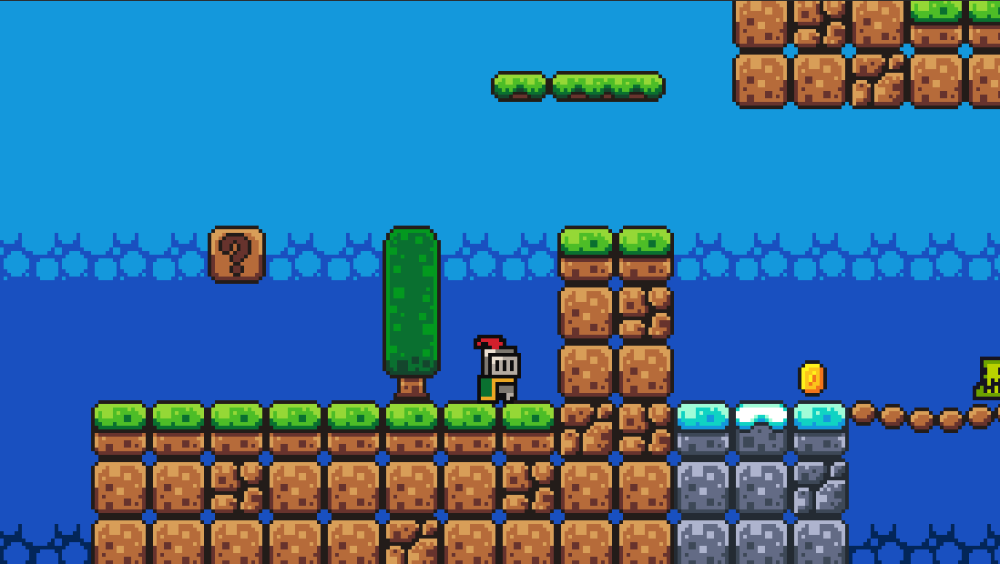

# Collision, Reusability, and Polish – Making a Simple Platformer Feel Real

*Part 4 of the Godot game development series. In this post, we move from “it works” to “it is structured” using collision rules, reusable scenes, enemy patrol behavior, and small polish systems.*

In the previous post, we built a full beginner gameplay loop.  
Now we take a step back and improve how the project is organized.

The goal is simple:  
**make the game easier to extend without things breaking or getting messy.**

The full project used in this tutorial is available in the [project repository](/games/2d-platform/), so you can inspect the same scenes and scripts.

---

## 1. Why This Post Matters

A lot of beginner platformers reach a point where:

* movement works  
* jumping feels fine  
* coins and enemies exist  

…but adding anything new becomes painful.

The problem is not the gameplay — it is the structure.

This post focuses on four practical upgrades:

1. clearer collision rules (who can touch what)
2. reusable scenes for faster level building
3. simple enemy behavior that is easy to read
4. small polish systems that make the game feel better

None of these are complex on their own.  
But together, they make your project feel much more “real” and scalable.



---

## 2. Collision Layers and Masks in Practice

Godot’s collision system is basically a filtering rule:

> “This object can only interact with these other objects.”

It helps avoid random or unexpected collisions in your game.

In this project, we keep things simple and consistent:

### Example setup

```text
Player:   Layer 1, Mask 2
World:    Layer 2, Mask 1
Coin:     Layer 3, Mask 1
```

This means:

* the player collides with the world
* the world collides with the player
* coins only react when the player enters them (via signals, not physics collision)

You don’t need to overthink it — the key idea is:

> Layers define *what I am*
> Masks define *what I can see / interact with*

---

### When things go wrong

If something “randomly doesn’t collide,” it is almost always one of these:

* wrong layer assignment
* missing mask target
* mixing physics collision vs Area2D signals

So a useful habit is:

> Always double-check layers before debugging code.

---

## 3. Reusable Scenes: Building Like Lego Blocks

Instead of building everything inside one big level, we split the game into small reusable scenes:

* `player.tscn`
* `coin.tscn`
* `slime.tscn`
* `platform.tscn`
* `kill_zone.tscn`

Then we place them into the level like building blocks.

This approach has a few big benefits:

* you only build logic once
* you can reuse objects anywhere in the game
* your main scene stays clean and readable

A good mental model is:

> The level is not where logic lives — it is where things are arranged.

This becomes especially important when levels get bigger or when you start adding multiple stages.

---

## 4. Beginner Enemy AI with `RayCast2D`

`Slime.cs` shows a very simple but powerful first AI pattern.

It moves in one direction until it hits something, then turns around.

```csharp
if (_rayCastRight.IsColliding())
{
    _direction = -1;
    _animatedSprite.FlipH = true;
}
else if (_rayCastLeft.IsColliding())
{
    _direction = 1;
    _animatedSprite.FlipH = false;
}

Vector2 velocity = Velocity;
velocity.X = _direction * Speed;
Velocity = velocity;
MoveAndSlide();
```

This works well for beginners because:

* it is easy to read
* it is easy to debug
* it does not require pathfinding or complex logic

---

### One important limitation

This AI does **not detect edges**.

That means the slime can walk off platforms if nothing blocks it.

But this is not a mistake — it is intentional.

> Simple systems are easier to understand and improve step by step.

Later, you can extend this by adding:

* edge detection using another RayCast2D
* faster or slower patrol speeds
* basic player detection for chase behavior

---

## 5. AnimationPlayer as Gameplay Logic, Not Just Visuals

In this project, animation is not only used for visuals — it is also part of the gameplay flow.

That means animation can *trigger or represent game events*.

Examples:

* coin plays a pickup animation when collected
* moving platforms are driven by AnimationPlayer tracks
* death overlay fades in to clearly show state change

---

### Key idea

> **AnimationPlayer can act as a timeline for gameplay, not just visuals.** Let animation handle *when things happen*, and code handle *what starts the process*. This separation keeps your logic clean and avoids timing issues that are hard to debug later.

This is powerful because it lets you build behavior without writing extra code.

For example, in the coin script:

```csharp
private void _on_body_entered(Node2D body)
{
    GD.Print("Coin collected by: " + body.Name);
    _AnimationPlayer.Play("pickup");
}
```

At first, it might feel natural to handle everything directly in code — play sound, hide the coin, then delete the object.

But this quickly becomes messy in practice.

For example, if you call `queue_free()` too early, you might:

* cut off the pickup sound
* remove the coin before the animation finishes
* end up with timing bugs that are hard to reason about

---

### Why AnimationPlayer works better here

Instead of trying to manage timing in code, we move those steps into the animation itself.

In the `pickup` animation, you can set up a simple sequence:

* play scale or fade animation
* trigger sound effect at the right frame
* hide or disable the coin near the end
* finally remove the node when everything is finished

Each step happens at the correct time automatically.


---

## 6. Small Polish, Big Difference: Camera + Audio + Death Feedback

From `game.tscn`, the player camera already includes:

* zoom for pixel-art readability
* level bounds (`limit_left`, `limit_top`, `limit_bottom`)
* smoothing for less jitter

We also add:

* jump and coin sound effects
* background music with autoplay
* slow-motion effect on death
* fade overlay before restarting the scene

---

None of these systems are complex on their own, but together they create the feeling of a complete game.

That is the real goal of polish — not adding complexity, but improving clarity and feedback.

---

## 8. Concepts Covered

Here is a quick recap of the main ideas we used in this part of the project:

| Concept | Why it matters |
| --- | --- |
| Collision layer/mask model | Makes interaction rules clear, predictable, and easy to debug |
| Reusable scenes | Lets you build levels faster without duplicating logic |
| `RayCast2D` patrol pattern | A simple and readable starting point for enemy AI |
| Animation-driven events | Keeps gameplay feedback smooth and easy to manage |
| Camera + audio polish | Adds clarity and “game feel” without complex systems |
| Safe refactors | Helps you grow the project without breaking existing features |

These are not advanced techniques — they are just practical habits that keep a small game from turning into a messy one.

The full project used in this tutorial is available in the [project repository](/games/2d-platform/), so you can inspect the same scenes and scripts.

---

### What to Build Next

If you want to continue building on this foundation, here are a few natural next steps:

* add a simple coin counter UI (so collecting feels meaningful)
* add checkpoints so players don’t restart from the very beginning
* add a stomp mechanic so the player can defeat slimes

Each of these fits directly into the structure you already have, without needing a rewrite.

They are small upgrades — but they are exactly how a prototype slowly becomes a complete game.
