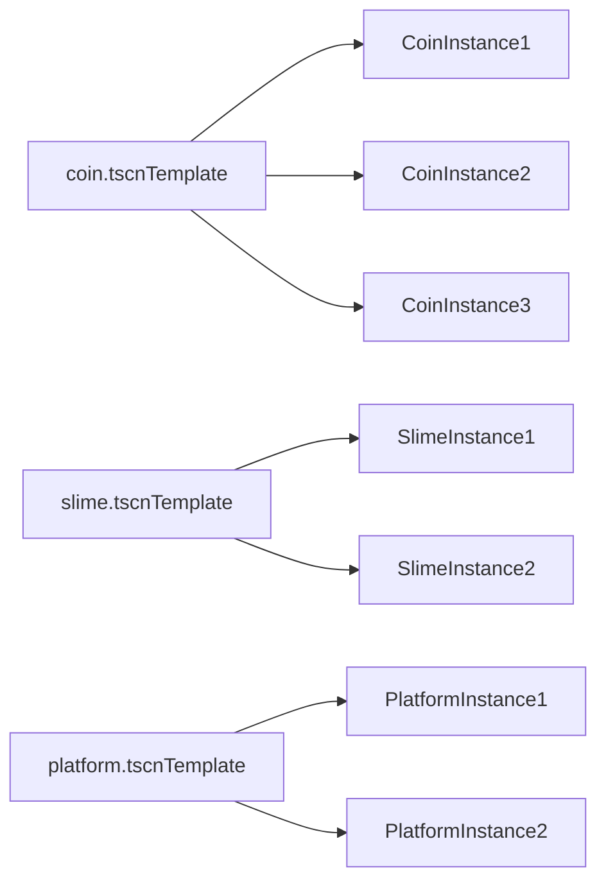

# Collision, Reusability, and Polish – Making a Simple Platformer Feel Real

*Part 4 of the Godot game development series. In this post, we move from “it works” to “it is structured” using collision rules, reusable scenes, enemy patrol behavior, and small polish systems.*

In the previous post, we built a full beginner gameplay loop.  
Now we focus on decisions that keep the game maintainable as features grow.

The full project used in this tutorial is available in the [project repository](/games/2d-platform/), so you can inspect the same scenes and scripts.

---

## 1. Why This Post Matters

Many beginner games stop at “player can move and jump.”  
That is a good start, but it often becomes hard to extend because logic is mixed everywhere.

This post covers four practical structure upgrades:

1. collision rules you can reason about
2. reusable scenes for fast level building
3. simple readable enemy AI
4. small polish systems that improve feel

None of these are advanced, but together they make a big quality jump.

---

## 2. Collision Layers and Masks in Practice

Godot collision settings answer one key question:

> Who exists on which layer, and who listens to which layers?

In this project:

* player interacts with level/world colliders
* coins and kill zones detect bodies through `body_entered`
* enemies use raycasts to detect obstacles and flip direction

When collisions feel “mysteriously wrong,” it is usually a layer/mask mismatch.

Practical beginner rule:

* keep a small table in your notes: **object -> layer -> mask**
* update that table whenever you add a new gameplay object

---

## 3. Reusable Scene Pattern: Author Once, Instance Many

`game.tscn` is efficient because it instances small scenes repeatedly:

* multiple coins from `coin.tscn`
* multiple slimes from `slime.tscn`
* multiple platforms from `platform.tscn`

This gives you two major benefits:

* **consistency**: every instance starts from the same structure
* **speed**: fixes in one scene propagate to every instance

So if you improve the coin pickup animation once, every placed coin benefits.



---

## 4. Beginner Enemy AI with `RayCast2D`

`Slime.cs` shows a great “first AI” pattern:

```csharp
if (_rayCastRight.IsColliding())
{
    _direction = -1;
    _animatedSprite.FlipH = true;
}
else if (_rayCastLeft.IsColliding())
{
    _direction = 1;
    _animatedSprite.FlipH = false;
}

Vector2 velocity = Velocity;
velocity.X = _direction * Speed;
Velocity = velocity;
MoveAndSlide();
```

Why this is beginner-friendly:

* easy to read
* easy to debug
* no pathfinding required

You can add challenge later by changing patrol speed, adding edge detection raycasts, or adding player-chase behavior.

---

## 5. AnimationPlayer as Gameplay Logic, Not Just Visuals

In this project, animation does more than “look nice”:

* `Coin` plays pickup animation on collision
* moving platform is driven by an `AnimationPlayer` track
* death overlay fades in with a tween for readable feedback

That means animation is part of the gameplay pipeline.

Example from coin flow:

```csharp
private void _on_body_entered(Node2D body)
{
    GD.Print("Coin collected by: " + body.Name);
    _AnimationPlayer.Play("pickup");
}
```

This keeps collect behavior expressive without complex code.

---

## 6. Small Polish, Big Difference: Camera + Audio + Death Feedback

From `game.tscn`, the player camera already includes:

* zoom for pixel-art readability
* level bounds (`limit_left`, `limit_top`, `limit_bottom`)
* smoothing for less jitter

Plus:

* jump and coin sound effects
* autoplay background music
* slow-motion death plus fade overlay before restart

These are “small” additions, but they are exactly what makes a prototype feel intentional.

---

## 7. Beginner Pitfalls and Safe Refactors

These are practical improvements you can make without changing core mechanics.

### A) Cache frequently used nodes

In `Player.cs`, `GetNode<AnimatedSprite2D>("AnimatedSprite2D")` is called repeatedly in `_PhysicsProcess`.  
A safer long-term pattern is to fetch once in `_Ready()` and store a field.

### B) Use custom input actions

The script currently uses default `ui_left`, `ui_right`, `ui_accept`.  
Create gameplay-specific actions like `move_left`, `move_right`, `jump` in Input Map so controls stay explicit.

### C) Guard body handlers by body type

`_on_body_entered` methods become safer if you check body type/group before acting.  
This prevents accidental behavior when non-player bodies trigger the same area.

These refactors are beginner-safe and improve future scalability.

---

## 8. Mini Experiment: Collision Rule Audit

Goal: build confidence with collision debugging.

Steps:

1. Pick one object type (for example `coin.tscn`).
2. Temporarily set an incorrect mask/layer.
3. Run game and observe what breaks (coin no longer collects, or wrong object triggers it).
4. Restore values and confirm behavior is fixed.

Measure:

* can you explain exactly why the interaction broke?
* can you fix it in under 2 minutes next time?

This is one of the highest-value beginner skills in physics games.

---

## 9. Concepts Covered

| Concept | Why it matters |
| --- | --- |
| Collision layer/mask model | makes interaction rules explicit and debuggable |
| Reusable scenes | reduces duplication and speeds level iteration |
| `RayCast2D` patrol pattern | simple, readable starter enemy behavior |
| Animation-driven events | keeps interaction flow expressive and clean |
| Camera/audio polish | improves game feel without complex code |
| Safe refactors | helps beginners scale from prototype to project |

---

### What to Build Next

If you want a clean next step after this beginner series:

* add a simple coin counter HUD
* add checkpoints before final restart
* add stomp behavior so player can defeat slimes

Each one builds naturally on the same structure you already have.
