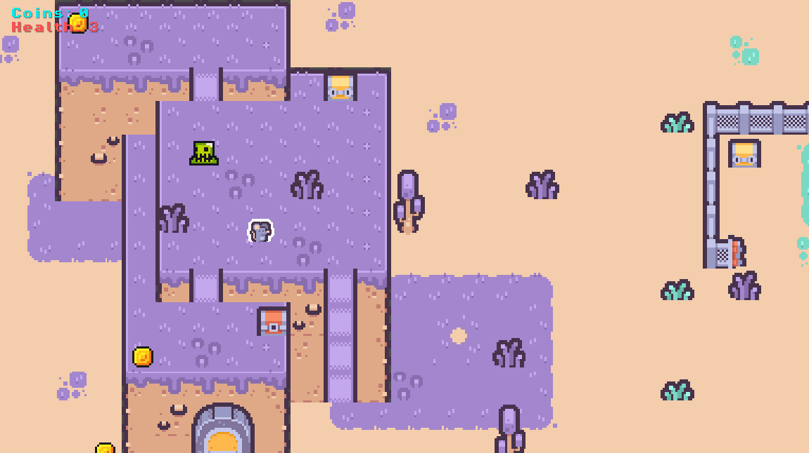
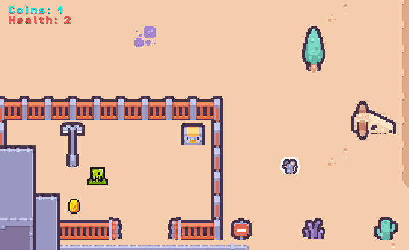

# From Platformer to RPG – Tiles, Top-Down Movement, and Game State

*Part 5 of the Godot game development series. In this post, we transition from platformer design to a top-down RPG and focus on two foundations: tile-based world building and a shared `GameManager` for run state.*

In the previous platformer posts, we worked with movement, collisions, and reusable scenes in a side-view game.

Now we switch genres to a **top-down 2D RPG**.

A lot will feel familiar:

* we still build the world with tiles  
* we still connect gameplay with signals  
* we still prefer reusable systems over hardcoded logic  

But one core thing changes immediately:

> In a top-down RPG, there is no gravity pulling the player down every frame.

The game still runs in real time, but the way movement and interactions feel is different.

In this post, we’ll focus on two foundations that become more important in this type of game:

* how we design the world using tiles  
* how we manage shared game state across the entire scene  

The full project used in this tutorial is available in the [project repository](/games/2d-rpg/), so you can follow along with the same scenes and scripts.

---

## 1. From Platformer Movement to Top-Down World Design

In the platformer, movement included gravity and jumping.  
The player was always either on the ground or in the air.



### 1.1 What this changes

In this RPG, movement is much simpler.

The player moves freely on the X/Y plane:

* input gives a direction  
* velocity is based on that direction  
* `MoveAndSlide()` applies movement and collision  

Conceptually:

```csharp
Vector2 direction = Input.GetVector("ui_left", "ui_right", "ui_up", "ui_down");
Vector2 velocity = direction * Speed;
Velocity = velocity;
MoveAndSlide();
```

There is no jump arc, no air state, and no gravity to manage. Because movement is simpler, the focus shifts to other parts of the game:

* how the map is laid out
* how players understand where they can go
* how interactions are placed (coins, enemies, weapons)
* how shared state is tracked (health, counters, progression)

So even though the movement code is shorter, the **overall design becomes more important**.

---

### 1.2 Tiles: same tool, different purpose

We still use the same tile workflow as before:

1. import a tileset
2. paint the level with tile layers
3. define which tiles are solid
4. separate visuals from gameplay

But the way players *read* the world is different.

In a platformer, tiles mainly define:

* floors
* walls
* jump paths

In a top-down RPG, tiles also guide the player:

* which areas are walkable
* which areas are blocked
* where something interesting might happen

---

## 2. Managing Game State with a GameManager

As soon as we add things like coins and damage, we run into a new problem:

> multiple parts of the game need to read and update the same data.

For example:

* coins increase when collected  
* health decreases when taking damage  
* the UI needs to display both  

If each scene keeps its own values, things quickly become messy and hard to sync.



---

### 2.1 A simple solution: one shared manager

Instead of spreading data across different nodes, we keep it in one place:

* a global `GameManager` (autoload)

It is responsible for tracking the current run:

* `Coins` → how many collected  
* `Health` → current player health  

And when something changes, it notifies the rest of the game using signals.

This keeps everything consistent and avoids tight coupling between gameplay and UI.

---

### 2.2 What the GameManager looks like

`GameManager.cs` is intentionally small and easy to understand:

```csharp
[Signal] public delegate void CoinsChangedEventHandler(int newValue);
[Signal] public delegate void HealthChangedEventHandler(int newValue);

public const int MaxHealth = 3;
public int Coins { get; private set; }
public int Health { get; private set; } = MaxHealth;
```

It also exposes a few simple methods:

* `AddCoin()` → called when picking up coins
* `TakeDamage()` → called when hit by enemies or hazards
* `ResetRun()` → resets everything on restart

---

### 2.3 Why this works well for beginners

This structure is powerful but still easy to follow:

* **all important values live in one place**
* **changes are announced using signals**
* **other nodes just react (UI, enemies, etc.)**

So instead of:

```
Coin → find UI → update label
```

you get:

```
Coin → GameManager → signal → UI updates
```

That small change makes your project much easier to extend later.

---

### 2.4 How gameplay uses the GameManager

Once we have a shared manager, gameplay objects no longer update the UI directly.

For example, when the player collects a coin, `Coin.cs` does this:

```csharp
private void _on_body_entered(Node2D body)
{
    if (_collected || body is not Player) return;

    _collected = true;
    GetNodeOrNull<GameManager>("/root/GameManager")?.AddCoin();
    _AnimationPlayer.Play("pickup");
}
```

Notice what is *not* happening here:

* no UI lookup
* no label updates
* no direct dependency on HUD

The coin simply reports:

> “a coin was collected”

and lets the `GameManager` handle the rest.

---

### 2.5 How the UI stays in sync

The HUD listens to the `GameManager` instead of being updated manually.

```csharp
gameManager.CoinsChanged += OnCoinsChanged;
gameManager.HealthChanged += OnHealthChanged;

OnCoinsChanged(gameManager.Coins);
OnHealthChanged(gameManager.Health);
```

So the full flow looks like this:

```text
Coin collected / damage taken
            ↓
GameManager updates state
            ↓
Signal emitted
            ↓
HUD updates display
```

This keeps responsibilities clean:

* gameplay scripts → trigger events
* GameManager → owns the data
* UI → displays the data

Without this structure, code often turns into:

```
Coin → find HUD → update label
```

That works at first, but quickly becomes hard to maintain.

With a `GameManager`, everything becomes predictable and easier to change.

---

### 2.6 Easy to extend later

Right now we only track:

* coins
* health

But adding more is straightforward:

* keys
* ammo
* XP / levels
* quest progress

You follow the same steps:

1. add a new value in `GameManager`
2. create a method to update it
3. emit a signal when it changes
4. let UI or systems react

This is a simple pattern, but it scales surprisingly well for beginner projects.

---

## 3. Concepts Covered

| Concept | Why it matters in this RPG |
| --- | --- |
| Top-down movement loop | Removes gravity/jump complexity and shifts focus to systems and interactions |
| Tile-based world design | Still the core level-building method, but with RPG navigation goals |
| Shared `GameManager` state | Keeps run data centralized and easy to reason about |
| Signals for UI updates | Decouples gameplay events from HUD rendering |
| Extension pattern | Makes it safe to add more counters and progression systems later |

These are simple ideas, but they remove a lot of chaos from beginner game projects.

The full project used in this tutorial is available in the [project repository](/games/2d-rpg/), so you can inspect the same scenes and scripts.

---

### Next Post

In the next post, we’ll build on this foundation and focus on combat systems:

* a scalable weapon architecture (`Weapon` base + specialized implementations)
* using collision events for hits and damage
* how enemies process damage and death effects

This is where the RPG starts to feel less like movement + pickups and more like a real action loop.
