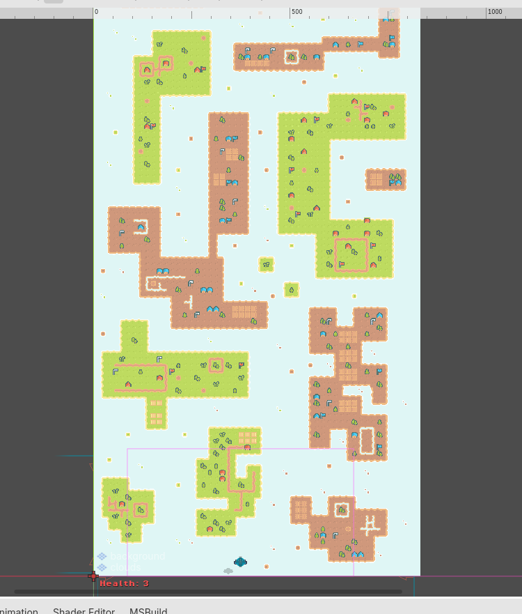
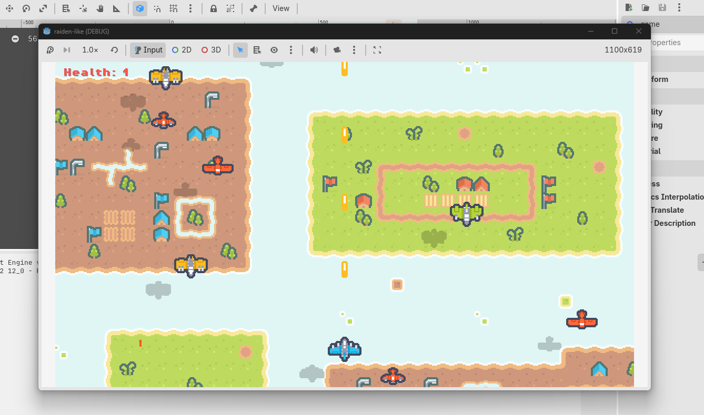

# From RPG to Scrolling Shooter – Reuse, Game State, and Infinite Background

*Part 7 of the Godot game development series. In this post we start our 4th game: a Raiden-like scrolling shooter. We’ll recap the reusable building blocks from earlier games (tiles, `GameManager`, HUD, weapons), then zoom in on the new core problem: making the world move by scrolling the background.*

In the previous posts we built:

- a turn-based chess game (clean structure + signals)
- a beginner platformer (physics loop + collisions)
- a top-down RPG (tiles + shared state + scalable combat)

Now we switch genres again: a **vertical scrolling shooter**.

At first glance, this looks very different from a platformer or an RPG.

But the *structure* of the game can stay surprisingly similar:

- we still build using reusable scenes
- we still keep shared run state in one place
- we still use collisions + signals to drive gameplay

The big new ingredient is this:

> The player stays roughly in place… and the world moves past them.

The full project used in this tutorial is available in the [project repository](/games/raiden-like/), so you can follow along with the same scenes and scripts.

---

## 1. Similarities: the reusable “backbone” shows up again

Even though this is a new genre, you don’t need to start from zero. A lot of the same building blocks still apply.

### 1.1 Tiles are still the fastest way to build a world

Just like the platformer and RPG, the shooter uses tiles to create a consistent look quickly.

The difference is *how the tiles are used*:

- platformer tiles define jump paths and solid platforms
- RPG tiles define walkable vs blocked space and guide navigation
- shooter tiles are mostly **visual pattern + readability** (what the player can see while moving fast)

So the tool is the same (`TileMapLayer`), but the goal is different.




---

### 1.2 `GameManager` + signals is still the cleanest run-state pattern

In the RPG we introduced a shared `GameManager` that owns run state (coins, health), and the UI simply listens.

That same structure works perfectly for a shooter:

```text
Enemy bullet hits player / Health pickup collected / Coin collected
                    ↓
            GameManager updates state
                    ↓
               signals emitted
                    ↓
                HUD updates
```

In `raiden-like`, `GameManager` stays small and focused: it owns `Coins`, `Health`, and a configurable `MaxHealth`, and it emits signals whenever values change.

```
public partial class GameManager : Node
{
	[Signal]
	public delegate void CoinsChangedEventHandler(int newValue);

	[Signal]
	public delegate void HealthChangedEventHandler(int newValue);

	private int _maxHealth = 3;

	/// <summary>Current run max HP (set from player export before <see cref="ResetRun"/>).</summary>
	public int MaxHealth => _maxHealth;

	public int Coins { get; private set; }
	public int Health { get; private set; } = 3;

	public void SetMaxHealth(int max)
	{
		_maxHealth = Mathf.Max(1, max);
	}

	public void AddCoin(int amount = 1)
	{
		if (amount <= 0)
			return;

		Coins += amount;
		EmitSignal(SignalName.CoinsChanged, Coins);
	}

	public void ResetRun()
	{
		Coins = 0;
		Health = _maxHealth;
		EmitSignal(SignalName.CoinsChanged, Coins);
		EmitSignal(SignalName.HealthChanged, Health);
	}

	public bool TakeDamage(int amount = 1)
	{
		if (amount <= 0 || Health <= 0)
			return Health <= 0;

		Health = Mathf.Max(0, Health - amount);
		EmitSignal(SignalName.HealthChanged, Health);

		return Health <= 0;
	}

	/// <returns><see langword="true"/> if any HP was restored (pickup consumed).</returns>
	public bool AddHealth(int amount = 1)
	{
		if (amount <= 0 || Health >= _maxHealth)
			return false;

		int before = Health;
		Health = Mathf.Min(_maxHealth, Health + amount);
		if (Health != before)
			EmitSignal(SignalName.HealthChanged, Health);

		return Health != before;
	}
}
```

This is a beginner-friendly pattern because the project has **one source of truth** for important values.

---

### 1.3 HUD stays decoupled by subscribing to signals

The HUD does not chase game objects to “pull” values. It simply listens to `GameManager` and updates text.

```
public partial class HUD : CanvasLayer
{
	private Label _coinLabel;
	private Label _healthLabel;

	public override void _Ready()
	{
		_coinLabel = GetNodeOrNull<Label>("MarginContainer/Stats/CoinLabel");
		_healthLabel = GetNode<Label>("MarginContainer/Stats/HealthLabel");

		GameManager gameManager = GetNodeOrNull<GameManager>("/root/GameManager");
		if (gameManager != null)
		{
			if (_coinLabel != null)
				gameManager.CoinsChanged += OnCoinsChanged;
			gameManager.HealthChanged += OnHealthChanged;
			if (_coinLabel != null)
				OnCoinsChanged(gameManager.Coins);
			OnHealthChanged(gameManager.Health);
		}
		else
		{
			if (_coinLabel != null)
				_coinLabel.Text = "Coins: 0";
			_healthLabel.Text = "Health: 3";
		}
	}

	public override void _ExitTree()
	{
		GameManager gameManager = GetNodeOrNull<GameManager>("/root/GameManager");
		if (gameManager != null)
		{
			if (_coinLabel != null)
				gameManager.CoinsChanged -= OnCoinsChanged;
			gameManager.HealthChanged -= OnHealthChanged;
		}
	}

	private void OnCoinsChanged(int newValue)
	{
		if (_coinLabel != null)
			_coinLabel.Text = $"Coins: {newValue}";
	}

	private void OnHealthChanged(int newValue)
	{
		_healthLabel.Text = $"Health: {newValue}";
	}
}
```

Same idea as the RPG posts, just applied in a new genre.

---

## 2. Scrolling the world: looping a tile pattern cleanly

The simplest way to create “infinite scrolling” is:

1. create a tile pattern that fills the screen
2. scroll it downward every frame
3. when it moves out of view, wrap it back above

But there’s one problem:

> If you scroll only one tilemap, you get empty space when it leaves the screen.



So we use two copies of the same tilemap pattern.

### 2.1 The “two layers” mental model

Think of it like this:

```text
[Pattern B]  ← starts above the screen
[Pattern A]  ← starts on the screen

Both scroll down.
When A goes fully below, it jumps back above B (and vice versa).
```

This creates the illusion of an endless scrolling world.

---

### 2.2 `BackgroundScroller` in code

In this project, the scrolling logic is implemented in a `TileMapLayer` script so it stays self-contained.

Here’s what the script is doing at a high level:

- compute the pattern height in pixels using `GetUsedRect()` and `TileSet.TileSize`
- create a second `TileMapLayer` at runtime
- copy tile data into it
- move both layers downward
- wrap positions when they pass the pattern height

Here is the full implementation:

```
public partial class BackgroundScroller : TileMapLayer
{
	[Export]
	public float ScrollSpeed = 80.0f;

	private float _patternHeightPixels;
	private TileMapLayer _secondaryLayer;
	private float _primaryY;
	private float _secondaryY;
	private bool _isInitialized;

	public override void _Ready()
	{
		Rect2I usedRect = GetUsedRect();
		Vector2I usedRectSize = usedRect.Size;
		Vector2I tileSize = TileSet.TileSize;
		_patternHeightPixels = usedRectSize.Y * tileSize.Y;

		if (_patternHeightPixels <= 0.0f)
		{
			GD.PushWarning($"{Name}: Background pattern height is zero. Scrolling disabled.");
			return;
		}

		CallDeferred(nameof(SetupSecondaryLayerDeferred));
	}

	private void SetupSecondaryLayerDeferred()
	{
		_secondaryLayer = new TileMapLayer();
		_secondaryLayer.Name = $"{Name}_loop_copy";
		_secondaryLayer.Set("tile_set", Get("tile_set"));
		_secondaryLayer.Set("tile_map_data", Get("tile_map_data"));
		_secondaryLayer.Set("modulate", Get("modulate"));

		Node parent = GetParent();
		if (parent == null)
		{
			return;
		}

		parent.AddChild(_secondaryLayer);
		_secondaryLayer.Owner = Owner;
		_secondaryLayer.ZIndex = ZIndex - 1;

		_primaryY = 0.0f;
		_secondaryY = -_patternHeightPixels;
		Position = new Vector2(Position.X, _primaryY);
		_secondaryLayer.Position = new Vector2(_secondaryLayer.Position.X, _secondaryY);
		_isInitialized = true;
	}

	public override void _Process(double delta)
	{
		if (_patternHeightPixels <= 0.0f)
		{
			return;
		}
		if (!_isInitialized || _secondaryLayer == null)
		{
			return;
		}

		float deltaY = ScrollSpeed * (float)delta;
		_primaryY += deltaY;
		_secondaryY += deltaY;

		if (_primaryY >= _patternHeightPixels)
		{
			_primaryY -= _patternHeightPixels * 2.0f;
		}
		if (_secondaryY >= _patternHeightPixels)
		{
			_secondaryY -= _patternHeightPixels * 2.0f;
		}

		Position = new Vector2(Position.X, _primaryY);
		_secondaryLayer.Position = new Vector2(_secondaryLayer.Position.X, _secondaryY);
	}
}
```

---

### 2.3 Why `CallDeferred` is used here

We create the second layer using `CallDeferred()`.

This ensures the scene tree is fully ready before we add new nodes.

Beginner rule of thumb:

> If you add nodes during `_Ready()` and something behaves strangely, try `CallDeferred()`.

---

### 2.4 Why this is a good beginner solution

There are many ways to do scrolling backgrounds (parallax, textures, shaders). This tilemap approach is a solid early step because:

- it’s easy to inspect and debug (just watch two layers move)
- it uses the same tile workflow you already learned
- it scales to adding details (variation tiles, decorations, multiple layers)

Once you understand *this* loop, you can later replace it with more advanced approaches without changing the rest of the architecture.

---

## 3. Concepts Covered

| Concept | Why it matters in a scrolling shooter |
| --- | --- |
| Tiles reused across genres | same tool, different design goals |
| Shared `GameManager` state | keeps coins/health consistent across gameplay systems |
| HUD via signals | avoids “gameplay scripts update labels” coupling |
| Two-layer background loop | simplest infinite scroll that doesn’t show gaps |
| `CallDeferred` for setup | safer scene-tree modifications during initialization |

The full project used in this tutorial is available in the [project repository](/games/raiden-like/), so you can follow along with the same scenes and scripts.

---

### Next Post

In the next post we’ll focus on the “active” part of the shooter loop:

- enemy types (different properties, different movement)
- auto spawning and difficulty ramp
- bullets that shoot downward (and spread)
- collision and health logic (including pickups that plug into `GameManager`)

