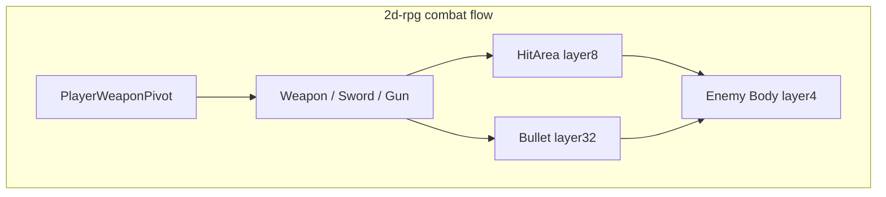

# Migrate 2d-rpg designs into arena-rogue

## What the repo already shows

| Area | [games/2d-rpg](games/2d-rpg) | [games/arena-rogue](games/arena-rogue) |
|------|------------------------------|----------------------------------------|
| Language | C# | C# (same — **no language rewrite**) |
| Run state | [`GameManager.cs`](games/2d-rpg/scripts/GameManager.cs) autoload: `Health`, `Coins`, `TakeDamage`, `ResetRun`, signals | Only [`SaveService.cs`](games/arena-rogue/scripts/SaveService.cs) autoload today |
| Player | [`Player.cs`](games/2d-rpg/scripts/Player.cs) drives `AnimatedSprite2D` (`idle` / `walk`), `player` group, flip | [`Player.cs`](games/arena-rogue/scripts/Player.cs) is movement-only; [`player.tscn`](games/arena-rogue/scenes/player.tscn) already has **AnimatedSprite2D** (node named `Sprite2D`) with animations **`idle`** and **`run`** — not wired in code |
| Weapons | [`PlayerWeaponPivot.cs`](games/2d-rpg/scripts/PlayerWeaponPivot.cs) + [`scripts/weapons/*`](games/2d-rpg/scripts/weapons/) + [`scenes/weapons/*.tscn`](games/2d-rpg/scenes/weapons/) | None |
| Player damage | [`KillZone.cs`](games/2d-rpg/scripts/KillZone.cs) calls `GameManager.TakeDamage` / `ResetRun` + scene reload | Not present |

---

## 1) Animations — what to copy vs redo in the editor

**Player locomotion (mostly code + small naming fix)**  
- **Copy the idea** from [`Player.cs`](games/2d-rpg/scripts/Player.cs): resolve the `AnimatedSprite2D`, `Play(...)` when moving vs idle, `FlipH` from horizontal input.  
- **Redo / align names**: Arena’s scene uses **`run`**, not `walk` ([`player.tscn`](games/arena-rogue/scenes/player.tscn)). Either rename the animation in the editor to `walk` to match 2d-rpg, or keep `run` and change the script to call `run` when `direction != Zero`.  
- **Optional editor polish**: Tweak frame speed/scale on the existing `SpriteFrames` resource in arena (already separate from 2d-rpg’s atlas paths).

**Weapon visuals and swing/shoot (redo in Godot, scenes portable)**  
- The sword “animation” is **not** on the player; it is **`AnimationPlayer` value tracks** on [`weapon_sword.tscn`](games/2d-rpg/scenes/weapons/weapon_sword.tscn) (sprite position over time) plus optional sound tracks.  
- **Practical approach**:  
  1. Copy `weapon_sword.tscn`, `weapon_gun.tscn`, `bullet.tscn` into `arena-rogue/scenes/weapons/`.  
  2. Copy the referenced **weapon textures** (and `tap.wav` if you keep sword audio) into `arena-rogue/assets/...`, then **fix every `ext_resource` path** in those `.tscn` files (UIDs will differ — Godot will reimport).  
  3. Open each weapon in the editor and confirm `AnimationPlayer` still has `RESET` and `attack` / `shoot`; tweak keyframes if your pivot positions differ from 2d-rpg’s layout.

**Why not “copy animation only”**  
- `.tscn` animation data is tied to **node paths** (`Sprite2D:position`, etc.). If hierarchy or sprite offsets differ, you adjust in the editor — that is the “redo in Godot” part.

---

## 2) Weapon system — step-by-step

1. **Copy C#** into arena: `Weapon.cs`, `WeaponEquipment.cs`, `WeaponSword.cs`, `WeaponGun.cs`, `Bullet.cs`, `PlayerWeaponPivot.cs` (from [`games/2d-rpg/scripts/`](games/2d-rpg/scripts/)).  
2. **Register the weapon scenes** under `arena-rogue/scenes/weapons/` as above; ensure [`Bullet.cs`](games/2d-rpg/scripts/weapons/Bullet.cs)’s default `BulletScene` path or export points to `res://scenes/weapons/bullet.tscn`.  
3. **Edit [`arena-rogue/scenes/player.tscn`](games/arena-rogue/scenes/player.tscn)**:
   - Set **`collision_layer = 2`** on `CharacterBody2D` (matches 2d-rpg player and keeps bullets from self-hits via group check).  
   - Add child `WeaponPivot` (`Node2D`) with `PlayerWeaponPivot` script; instance copied `weapon_sword` and `weapon_gun` as children (mirror [`2d-rpg/scenes/player.tscn`](games/2d-rpg/scenes/player.tscn)).  
4. **Input map** — copy from [`2d-rpg/project.godot`](games/2d-rpg/project.godot) into arena’s [`project.godot`](games/arena-rogue/project.godot): `attack` (mouse left + optional key) and `weapon_cycle` (Tab).  
5. **Physics layers** (must match comments in [`WeaponEquipment.cs`](games/2d-rpg/scripts/weapons/WeaponEquipment.cs)):  
   - Tiles/world: **layer 1** (arena [`game.tscn`](games/arena-rogue/scenes/game.tscn) `TileMapLayer` already uses `physics_layer_0/collision_layer = 1`).  
   - Player body: **layer 2**.  
   - Enemies (when you add them): **layer 4**, group `enemies`, implement `TakeDamage` like [`Slime.cs`](games/2d-rpg/scripts/Slime.cs).  
   - Sword `HitArea`: **layer 8**, mask includes **4** (see copied `weapon_sword.tscn`).  
   - Bullet: **layer 32**, mask **5** (world + enemies) per [`bullet.tscn`](games/2d-rpg/scenes/weapons/bullet.tscn).  
6. **World parent for bullets**: [`WeaponGun.cs`](games/2d-rpg/scripts/weapons/WeaponGun.cs) parents bullets to a node three levels up; after you nest under `Game`, verify bullets still land under the correct `Node2D` (adjust the climb or export a `NodePath` if the hierarchy differs).

---

## 3) Game manager (health, coins, reset) — step-by-step

1. **Copy** [`GameManager.cs`](games/2d-rpg/scripts/GameManager.cs) to `arena-rogue/scripts/`.  
2. **Autoload** in [`arena-rogue/project.godot`](games/arena-rogue/project.godot): add `GameManager="*res://scripts/GameManager.cs"` **alongside** existing `SaveService` (order usually does not matter for these two).  
3. **Wire UI later** (pattern from [`HUD.cs`](games/2d-rpg/scripts/HUD.cs)): subscribe to `HealthChanged` / `CoinsChanged` when you add a HUD `CanvasLayer` to arena’s game scene.  
4. **Player hazards**: When you add pits/traps, copy/adapt [`KillZone.cs`](games/2d-rpg/scripts/KillZone.cs) + scene (overlay, timer, sounds) — it already calls `/root/GameManager` for damage and `ResetRun` + `ReloadCurrentScene` on death.  
5. **Saves vs run state**: [`SaveService`](games/arena-rogue/scripts/SaveService.cs) is persistence; `GameManager` is **session** health/coins. If you want health in save files, extend your save DTO and call `GameManager` setters when loading (explicit design choice — not required for first combat pass).

---

## 4) Suggested order of work

1. `GameManager` autoload + (optional) minimal HUD label to prove signals.  
2. Fix `Player.cs` animation + `AddToGroup("player")` + collision layer 2.  
3. Copy weapon scripts + weapon/bullet scenes + assets; fix paths; add `WeaponPivot` to player.  
4. Add `attack` / `weapon_cycle` to input map; playtest sword/gun in empty arena (bullets should die on tilemap).  
5. Add enemies or targets (slime scene copy + layer 4) so `TakeDamage` paths execute.  
6. Add `KillZone` (or arena-specific hazard) when you need player damage/death loop.

---

## Files you will touch most

- [`games/arena-rogue/project.godot`](games/arena-rogue/project.godot) — autoloads, input.  
- [`games/arena-rogue/scenes/player.tscn`](games/arena-rogue/scenes/player.tscn) — pivot, weapons, collision layer.  
- [`games/arena-rogue/scripts/Player.cs`](games/arena-rogue/scripts/Player.cs) — animation + group.  
- New: `games/arena-rogue/scripts/GameManager.cs`, `games/arena-rogue/scripts/weapons/*.cs`, `games/arena-rogue/scenes/weapons/*.tscn`, plus copied textures/sounds.
