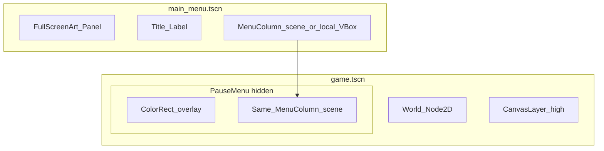

# Combined plan: §1 Reusable menu UI (main + ESC pause)

This replaces the narrative in [games/arena-rogue/.cursor/plans/arena-rogue_menus_saves_eb26c72f.plan.md](games/arena-rogue/.cursor/plans/arena-rogue_menus_saves_eb26c72f.plan.md) **§1 only** (lines 56–66). All other sections (autoloads, slots, options, order) stay as in that file.

---

**Goal:** Same visual language and shared logic; **not** identical button lists or chrome (pause needs Resume + Save; main needs Exit; backgrounds differ).

### Reusable UI (pick one primary pattern)

1. **Reusable sub-scene (recommended, matches your paste)**  
   - Extract a **`UIMenu` / `MenuColumn` .tscn**: centered **Panel** + **`VBoxContainer`** for buttons (optional subtitle slot).  
   - **Instance it** in [main_menu.tscn](games/arena-rogue/scenes/main_menu.tscn) under the existing full-screen art/title, and **again** in the game scene’s pause overlay (hidden by default).  
   - **Customization:** small script with an **`enum MenuMode { Main, Pause }`** or booleans; e.g. show **Resume** / **Save** only in pause, **Continue** / **New Game** / **Exit** only on main—same idea as `SetMode(bool isPauseMenu)` toggling `Visible` on nodes.  
   - Keeps one place to edit button **Theme** / StyleBoxes so you do not duplicate subresources across scenes.

2. **Shared Theme only (lightweight)**  
   - If you prefer minimal scene splitting: a **`.theme` resource** on buttons in both main and pause still gives consistency; use when the layouts diverge a lot and you do not want a packed sub-scene.

3. **Scene inheritance (Godot-native alternative)**  
   - **`BaseMenu.tscn`**: fonts, panel styles, default button theme.  
   - **New Inherited Scene** → `MainMenu.tscn` vs `PauseMenu.tscn` with different child buttons.  
   - Use when main vs pause differ **more** than visibility toggles; base changes propagate to both.

*Practical blend for this repo:* today [main_menu.tscn](games/arena-rogue/scenes/main_menu.tscn) already has a full-screen **Panel** (background texture) + title **Label** + **VBoxContainer**. A good fit is **reusable column** (Panel+VBox+script) **plus** optional **shared Theme** on buttons; keep full-bleed background and title as **main-only** nodes, and use **only** overlay + column for pause.

### Layered overlay in the game scene

- **Tree shape:** `World` (`Node2D` / gameplay) and **`UI_Canvas` (`CanvasLayer`, high `layer`)** as siblings under [game.tscn](games/arena-rogue/scenes/game.tscn) root (or under a `Node` root if you refactor).  
- Under `UI_Canvas`: **`PauseMenu` (`Control`, `Visible = false`)** → full-screen **`ColorRect`** (semi-transparent dimmer) + centered panel (your reused column scene).  
- **Script:** `PauseMenuController` / `GameUI` on the layer or pause root (as already planned).

### ESC + engine pause (critical detail)

- Toggle **`PauseMenu.Visible`** and **`GetTree().Paused`**.  
- Set the pause menu branch (or `CanvasLayer`) **`ProcessMode` = `Always`** so input and UI still run while the tree is paused—otherwise clicks and ESC handling freeze with the world.  
- Input: **`Game` `_UnhandledInput`** / `_Input` + **`SetInputAsHandled()`** so the key does not leak to gameplay.  
- Optional: release mouse capture later if you add it.

### UX: make “which screen am I on?” obvious

| Aspect | Main menu | Pause menu |
|--------|-----------|------------|
| Background | Full art / current full-screen panel | Semi-transparent overlay (no duplicate heavy art required) |
| Primary action | Continue / New Game | Resume |
| Context | Title / version (optional) | Level / score / playtime (optional, minimal first) |
| Quit | Quit to desktop | Quit to main menu (and unpause / `ChangeSceneToFile` main menu) |

### Unchanged bullets from the original §1 (still required)

- **Continue / Load Save visibility:** in `MainMenu._Ready()`, use `SaveService` — if `GetLastSlot()` is valid and `SlotExists(last)`, show/enable **Continue**; else hide/disable. Same idea for **Load Save** when no slots exist.  
- **Per-button handlers** in [MainMenu.cs](games/arena-rogue/scripts/MainMenu.cs): replace the single shared `Pressed` hook where needed so **Exit** → `GetTree().Quit()` and other buttons get distinct logic (already partially done for Continue/Exit).

---

