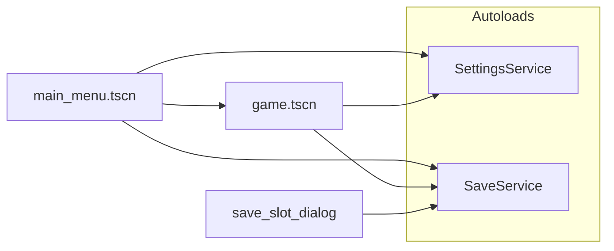

# arena-rogue: menus, saves, options

## Current state

- [games/arena-rogue/scenes/main_menu.tscn](games/arena-rogue/scenes/main_menu.tscn): title, `VBoxContainer` with Continue / New Game / Load Save / Options / Exit, `MainMenu.cs` on root only plays [ClickSound](games/arena-rogue/scenes/main_menu.tscn) for every button ([MainMenu.cs](games/arena-rogue/scripts/MainMenu.cs)).
- [games/arena-rogue/scenes/game.tscn](games/arena-rogue/scenes/game.tscn): `Node2D` + `TileMapLayer` + instanced `Player` — **no script**, no UI layer, no input handling for pause.
- [project.godot](games/arena-rogue/project.godot): C# / .NET 8; **no custom InputMap entries yet** (add e.g. `pause` on `Escape` when implementing pause).

## Architecture (recommended)

- **Two autoload singletons** (register in `project.godot` under `[autoload]`):
  - **`SettingsService`**: loads/saves `user://settings.json` (music volume 0–1, fullscreen bool). On `_Ready`, applies `AudioServer` bus volume and `DisplayServer.WindowSetMode` / `WindowSetFlag` for fullscreen.
  - **`SaveService`**: owns slot count constant (e.g. 3), paths `user://saves/slot_{n}.json`, and **`user://saves/meta.json`** for “last played slot” and lightweight per-slot labels (optional: timestamp / playtime for UI). Exposes: `SlotExists(int)`, `GetLastSlot()`, `SetLastSlot(int)`, `WriteSave(int, GameSaveData)`, `TryReadSave(int, out GameSaveData)`, `DeleteSlot(int)` if you want empty slots for New Game.

This keeps menu scenes thin and makes **in-game save** a single call: `SaveService.WriteSave(SaveService.CurrentSlot, data)` where `CurrentSlot` is set when starting New Game or loading a slot.

## 1) Reusable menu UI (main + ESC pause)

**Goal:** Same visual language and shared logic; **not** identical button lists (pause needs Resume, main needs Exit, etc.).

- Extract a small **reusable building block**:
  - Either a **packed scene** for one styled menu column (Panel + `VBoxContainer` + optional title) that both screens instance, **or** a shared **Theme** resource applied to buttons so `main_menu.tscn` and pause UI stay consistent without duplicating StyleBox subresources.
- Add a **`PauseMenuController`** (or `GameUI`) script on a **`CanvasLayer`** child of the game scene so UI is screen-space above the world. Full-screen `ColorRect` (semi-transparent) + centered panel captures focus while open.
- **ESC behavior:** in `Game`’s `_UnhandledInput` (or `_Input` with `SetInputAsHandled()`), toggle pause: `GetTree().Paused = true/false`, show/hide overlay, optionally release mouse if you use mouse capture later.
- **Continue visibility:** in `MainMenu._Ready()`, call `SaveService` — if `GetLastSlot()` is valid and `SlotExists(last)`, show/enable **Continue**; else hide or disable it. Same check can drive **Load Save** (hide if no slots exist, or show disabled).

Per-button handlers in `MainMenu` replace the single shared `Pressed` hook so **Exit** calls `GetTree().Quit()` without needing the same logic as **New Game**.

## 2) Play / Continue → game scene

- Use **`GetTree().ChangeSceneToFile("res://scenes/game.tscn")`** (or `PackedScene.Instantiate` + `change_scene_to_packed` if you prefer).
- **Before** changing scene, set session state on autoload:
  - **Continue:** `SaveService.CurrentSlot = SaveService.GetLastSlot()` and set a flag `PendingLoad = true` (or pass intent enum: `NewGame`, `LoadExisting`).
  - **New Game:** after slot picker, `CurrentSlot = chosen`, `PendingLoad = false`, optionally write a **minimal initial JSON** so the slot is “taken” immediately, or defer first write until first in-game save.
- **`Game` script** (new, on root — recommend changing root type to **`Node`** with a child `Node2D` `World` holding current tilemap/player, **or** keep `Node2D` root and add `CanvasLayer` as sibling under root; both work): in `_Ready()`, if `PendingLoad`, call `SaveService.TryReadSave` and **`ApplySave(GameSaveData)`** (set player `GlobalPosition`, future stats). Clear `PendingLoad` after apply.

## 3) Save slots, JSON format, New Game / Load / in-game save

**Files**

- `user://saves/slot_0.json` … `slot_{N-1}.json` — full game state.
- `user://saves/meta.json` — e.g. `{ "version": 1, "last_slot": 0, "slots": { "0": { "exists": true, "updated_unix": 123 } } }` so the UI can list slots without parsing full saves.

**JSON body (start minimal, versioned)**

- Top-level: `version` (int), `slot` (int), `saved_at` (ISO or unix), `player` (e.g. `x`, `y` as doubles).
- Later you add `inventory`, `progress`, etc. without breaking if you check `version` when deserializing.

**C#:** use **`System.Text.Json`** with small DTOs (`GameSaveData`, `PlayerSaveData`). Serialize with `JsonSerializer.Serialize` to string, write via Godot **`FileAccess.Open` + `StoreString`** (or .NET `File` with paths from `ProjectSettings.GlobalizePath` if you standardize on `user://` — Godot’s `FileAccess` is straightforward).

**Flows**

- **New Game:** open **slot picker** (`AcceptDialog` or custom `Window` + grid of buttons). Empty slot → confirm start; occupied slot → confirm overwrite → delete old file / reset meta, then switch to game with `PendingLoad = false` and empty state.
- **Load Save:** same dialog but only enabled slots (or show all with “Empty” disabled).
- **Continue:** skip dialog; use `last_slot` from meta if valid.
- **In-game save:** bound to pause menu “Save” and/or a key; writes to **`CurrentSlot`** only; updates `meta.json` and `last_slot`.

## 4) Options (music volume + fullscreen)

- **`settings.json`**: e.g. `{ "music_volume": 0.8, "fullscreen": false }`.
- **Audio:** ensure a dedicated **Music bus** in the Audio Bus layout (editor). Route menu `BGMusic` (and future game music) to that bus. `SettingsService` sets volume with `AudioServer.SetBusVolumeDb` from linear 0–1 (Godot helper or manual db curve).
- **Fullscreen:** `DisplayServer.WindowSetMode(fullscreen ? Fullscreen : Windowed)` (and on Windows consider `ExclusiveFullscreen` vs `Fullscreen` later if needed).
- **Options UI:** sub-panel from main menu and from pause menu: `HSlider` + `CheckButton`, read/write via `SettingsService`; call `SettingsService.Save()` on change or on “Apply/Back”.

## 5) Suggested implementation order

1. Add **`SettingsService`** + default bus setup + **`settings.json`** load/apply/save.
2. Add **`SaveService`** + DTOs + `meta.json` + slot file I/O + `CurrentSlot` / `PendingLoad` / `GetLastSlot`.
3. Build **`save_slot_dialog.tscn`** (+ small script) and wire **New Game** / **Load Save** / **Continue** in **`MainMenu.cs`**; implement **scene change** to `game.tscn`.
4. Add **`Game.cs`** + **`CanvasLayer`** pause overlay; implement ESC, **Resume**, **Save**, **Options** (reuse options panel scene), **Main Menu** (`ChangeSceneToFile` back to main menu, `GetTree().Paused = false`).
5. Implement **`ApplySave` / `CollectSave`** on `Game` (player position first); tune **Continue** visibility rules.

## Design notes / small decisions (no need to block you)

- **Continue vs Load Save:** Continue = one-click **last_slot**; Load Save = pick any occupied slot. Clear and consistent.
- **Root node type:** Prefer **`Node` + `World` (Node2D)** if you want a clean separation; otherwise keep **`Node2D`** and attach **`CanvasLayer`** as first UI child — both are valid.
- **`.godot/` in git:** your repo shows untracked editor cache under `games/arena-rogue/.godot/`; consider adding to `.gitignore` separately from this feature work.
