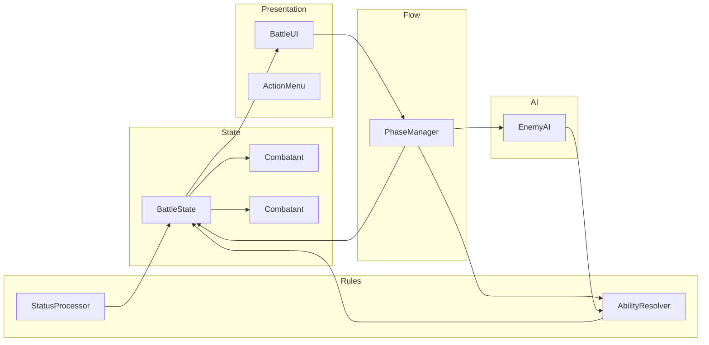

# Turn-Based RPG Combat Prototype

## Context

Your [README](README.md) already lists a "Turn-based battle system (inspired by Pokémon)" in Stage 2, and future blog topics include "Designing a turn-based combat system." The chess game in [games/chess-game/](games/chess-game/) uses a clear split: **Board** (pure state + rules), **BoardManager** (UI grid), **SelectionManager**, **HistoryManager**, and **Main** (orchestration + input). The combat prototype should follow the same idea: **state and rules in one place, presentation in another, and a thin coordinator**—so no single "God" class owns everything.

---

## 1. Where it lives

- **New Godot 4 C# project:** e.g. `games/rpg-combat/` (or `games/turn-based-combat/`) alongside `games/chess-game/`.
- Same repo, same tech (Godot 4, C#). No overworld, inventory, or story—combat sandbox only.

---

## 2. Minimal scope (first playable)


| Element    | Content                                                                                                                   |
| ---------- | ------------------------------------------------------------------------------------------------------------------------- |
| **Player** | HP: 100, MP: 20. Actions: Attack (10 dmg), Defend (reduce dmg), Skill (big dmg, costs MP).                                |
| **Enemy**  | HP: 80. Actions: Attack, Heavy Attack, Charge.                                                                            |
| **Flow**   | Player turn → choose action → apply effect → Enemy turn → AI chooses action → apply effect → repeat until victory/defeat. |


Optional later: **timing mechanic** (e.g. press at right moment for critical), as in Clair Obscur.

---

## 3. Architecture that avoids a God-class BattleManager

The usual mistake is one class that both holds battle state and runs turn flow, applies damage, updates UI, and drives AI. Instead, split responsibilities like this:




- **BattleState (or CombatContext)**  
Holds current combat snapshot: list of combatants (player + enemies), each with HP, MP, status effects, etc. **No turn logic, no UI.** Comparable to your `Board`: pure state.
- **PhaseManager (turn / state machine)**  
Owns combat phases: `PlayerTurn`, `PlayerAnimation`, `EnemyTurn`, `EnemyAnimation`, `Victory`, `Defeat`. It decides "what phase we are in" and "when to transition." It does **not** compute damage or apply abilities; it asks other systems to do that and then updates phase (e.g. after an action is applied, switch to EnemyTurn).
- **AbilityResolver (or ActionExecutor)**  
Given: current `BattleState`, chosen ability, caster, target(s). Returns: **delta** (damage dealt, MP cost, statuses added/removed) or a new state slice. No phases, no UI—only "if you do this ability in this state, here is the result." Formulas (damage, cost) live here or in ability data.
- **StatusProcessor**  
Given current state, applies "start of turn" or "end of turn" effects (poison tick, defense up, stun). Returns updates to state. Keeps status logic out of PhaseManager and BattleState.
- **EnemyAI**  
Given read-only `BattleState`, returns one chosen action (e.g. "use HeavyAttack on player"). No state mutation, no UI. Simple heuristics (e.g. if player HP low → heavy attack; else → attack or charge).
- **BattleUI / ActionMenu**  
Present current state (HP/MP bars, status icons). Show menu (Attack / Skill / Defend / Item). On choice, emit a signal: "player chose this ability and target." No game rules, no phase logic.
- **Thin coordinator (BattleRunner or BattleController)**  
The only place that wires everything: listens to PhaseManager and UI/AI, calls AbilityResolver and StatusProcessor, applies results to BattleState, notifies PhaseManager to advance phase, and lets BattleUI read from BattleState. Stays thin: no damage formulas, no phase enum logic duplicated—it just connects components.

This keeps **state**, **phase flow**, **rules (abilities + status)**, **AI**, and **UI** separate and testable, and avoids a single class that "does it all."

---

## 4. Suggested folder layout (C# / scenes)

Mirror your chess layout: a clear split between logic and scene/UI.

```
games/rpg-combat/
  project.godot
  CombatGame.sln / .csproj
  scenes/
    Main.tscn          # Battle screen
    BattleUI.tscn      # HP/MP bars, action menu
  scripts/
    Main.cs            # Entry, creates BattleRunner and wires scene
  combat/              # Logic (like chess/ in chess-game)
    BattleState.cs     # Combatants, current HP/MP, status list
    Combatant.cs       # One actor (player or enemy): stats, HP, MP, statuses
    PhaseManager.cs    # Phase enum + transitions
    AbilityResolver.cs # Resolve ability vs BattleState → result/delta
    StatusProcessor.cs # Tick status effects
    AbilityData.cs     # Name, damage, cost, target type, effect
    StatusEffectData.cs
  ai/
    EnemyAI.cs         # Given BattleState, return chosen action
  ui/
    BattleUI.cs        # Updates from BattleState, emits action selected
    ActionMenu.cs      # Buttons/signals for Attack / Skill / Defend
```

You can add `AbilityDatabase` (list of AbilityData) and optionally a small **timing** module later (timer + "press at moment" for critical) without turning BattleState or PhaseManager into a God class.

---

## 5. Data-driven abilities

- **AbilityData** (or similar): fields such as `Name`, `Damage`, `ManaCost`, `TargetType` (single enemy, self, etc.), optional `StatusEffectId` and duration. No behavior in data—just numbers and IDs.
- **AbilityResolver** reads AbilityData and current BattleState, computes result (damage after defense, MP check, etc.), and returns a **result object** (damage dealt, MP spent, status applied). The coordinator applies this to BattleState. This keeps "what each ability does" in data + resolver, not in the coordinator.

---

## 6. Status effects (minimal first)

- **StatusEffectData**: id, name, duration, effect per turn (e.g. poison -5 HP), type (buff/debuff).
- **Combatant** has a list of (StatusEffectData, remainingTurns).
- **StatusProcessor** runs at a defined point (e.g. start of turn or end of turn), ticks durations and applies effects, returns changes; coordinator applies to BattleState. Start with 1–2 (e.g. Poison, Defend) to validate the pipeline.

---

## 7. Enemy AI (heuristic)

- **EnemyAI** receives read-only BattleState (or an interface). Decides action from rules like: "if player HP < 20 then use HeavyAttack else 70% Attack / 30% Charge." Returns an action (ability id + target); coordinator passes it to AbilityResolver and applies result. No ML required.

---

## 8. Combat UI (learning target)

- One scene/screen: enemy info (name, HP bar), player info (HP, MP bars), and an action menu (Attack, Skill, Defend, Item).
- **BattleUI** gets state from BattleState (or from coordinator via signal/property) and updates bars and labels. Menu emits "ActionSelected(abilityId, target)". Keeps UI dumb and event-driven, same idea as chess squares emitting clicks.

---

## 9. Optional: timing / critical (Clair Obscur style)

- Add later: after player picks an attack, show a short timing window; if the player presses a key at the right moment, treat the hit as critical (e.g. 1.5x damage). Implement as a small **TimingChecker** or flag in the resolver: "was this a critical?" Coordinator runs the timer, sets the flag, then calls resolver. Keeps timing and feedback in one place without bloating PhaseManager or BattleState.

---

## 10. Blog series (aligned with implementation)

You can map implementation steps to posts so each post has a clear deliverable:


| Part | Topic                                                 | Implementation slice                                                        |
| ---- | ----------------------------------------------------- | --------------------------------------------------------------------------- |
| 1    | Designing a turn-based combat loop (Pokémon-inspired) | BattleState, Combatant, PhaseManager; minimal flow (player → enemy → loop). |
| 2    | Building a combat state machine in Godot              | PhaseManager in detail, transitions, signals.                               |
| 3    | A flexible, data-driven ability system                | AbilityData, AbilityResolver, no God class.                                 |
| 4    | Status effects (buffs/debuffs)                        | StatusEffectData, StatusProcessor, integration with BattleState.            |
| 5    | Simple enemy AI                                       | EnemyAI, heuristics, reading BattleState.                                   |
| 6    | Combat UI design                                      | BattleUI, ActionMenu, feedback and animations.                              |
| 7    | Balancing (damage formulas, tuning)                   | Formulas in AbilityResolver, tuning and playtesting.                        |


Optional 8: timing/critical mechanic (Clair Obscur twist).

---

## 11. Out of scope (by design)

- No inventory, map, dialogue, leveling, or story.
- No deckbuilding or card content pipeline.
- Combat only: one battle scene, one player, one enemy type to start. Expand later (multiple enemies, party) using the same architecture.

---

## Summary

- **New project:** `games/rpg-combat/` (or similar), Godot 4 C#.
- **Minimal first version:** Player (Attack / Defend / Skill) vs one enemy (Attack / Heavy / Charge), turn loop until victory/defeat.
- **Architecture:** BattleState (state), PhaseManager (phases), AbilityResolver + StatusProcessor (rules), EnemyAI (decisions), BattleUI + ActionMenu (presentation), thin coordinator that wires them. This avoids a God-class BattleManager and matches the separation you already use in chess (Board vs BoardManager vs Main).
- **Blog series:** Seven (or eight) parts aligned with state machine, abilities, status effects, AI, UI, and balancing, with optional timing post.

If you want, the next step can be a **concrete class/signal checklist** (e.g. which signals PhaseManager emits, what BattleState exposes, and the exact method signatures for AbilityResolver and the coordinator) so you can implement phase-by-phase without overbuilding.